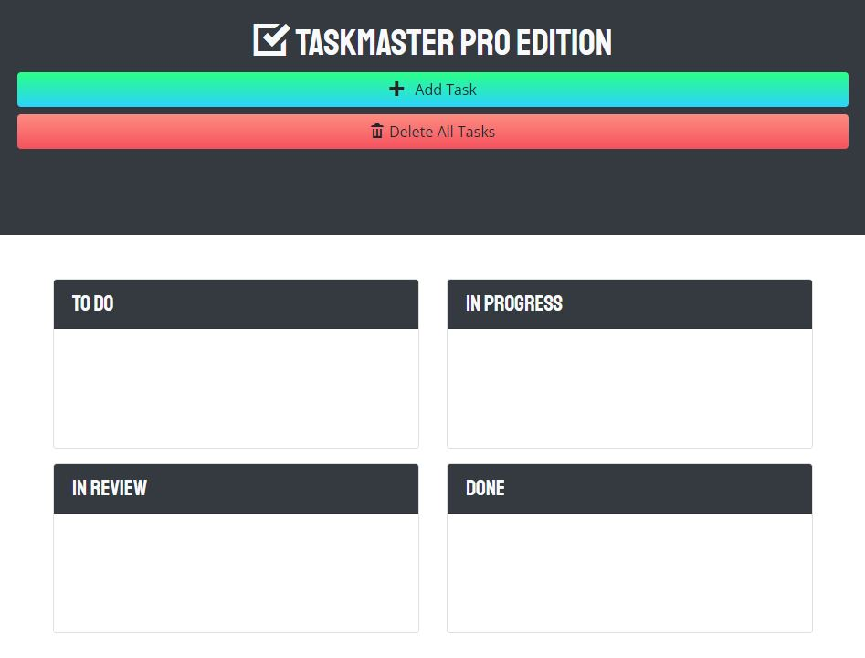

# Taskmaster Pro

## Table-of-Contents

- [Description](#description)
- [Deployed Site](#deployed-site)
- [Features](#features)
- [Technologies](#technologies)
- [Future Development](#future-development)
- [Credits](#credits)

## Description

With this application, you can keep track of your tasks. Simply click "Add Task" to be presented with an input form that allows you to track the name of the task and due date. Once you've submitted your task, it appears in the to-do column. This application allows you to interactively edit your tasks, as well as drag and drop them into the appropriate columns. All of these features were possible through collaberation. This project was built with an existing codebase in order to expand a task-management application, adding new date and organizational functionality using jQuery, Bootstrap, and Moment.js.

## Deployed Site

Follow [this link](https://ashlynn4567.github.io/Taskmaster-Pro/) to view and use my site!

## Features

This is how the main page appears to users. The page is responsive, adapting to multiple screen sizes.

With this application, you can keep track of your tasks. There are features built in that allow you to dynamically drag and drop your tasks into four different columns (to-do, in progress, in review, and done). The UI shows you which tasks are due soon by changing their color to yellow. If the task is past due, it will be colored red.

The user can interact with the input box at the top of the page to type a task name, select a task type, and save it to their dashboard. The saved task automatically goes into the "Tasks to Do" column. There are also interactive buttons that dynamically appear on the task itself. The user can use these buttons to edit/update their tasks, or delete them from view.

If the user wishes to change the status of their task, they can use the dropdown list interactively to move each task to whatever column they want. Users can also delete tasks by dragging them into the 'delete task' section that appears when the user begins dragging the task.

The tasks each user creates is saved in their local storage. This way, even if the user refreshes the page or returns to it at a later date, their tasks are saved.

## Technologies

- HTML
- CSS
- [Bootstrap](https://getbootstrap.com/)
- JavaScript
- [jQuery](https://jquery.com/)

## Future Development

In the future, I would like to add the following improvements:

- I would like to add the option for users to select a time for which their tasks are due.
- I would like the current date and time to display on the sidebar to show users how close their deadlines are approaching.

I'm always interested in refactoring code to improve it's functionality. If you would like to suggest your own improvements, you can reach me at the links below.

- <a href="mailto:ashleylynnsmith.dev@gmail.com">Email</a>
- <a href="https://github.com/ashlynn4567">GitHub</a>
- <a href="https://www.linkedin.com/in/ashley-lynn-smith/">LinkedIn</a>

## Credits

This project was built with the help of the University of Oregon's Coding Boot Camp.

## Licensing

The application is covered under the following license: [MIT](https://opensource.org/licenses/MIT)
